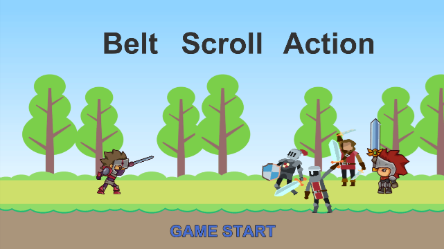

Unityで作成したベルトスクロールアクションゲーム

出現する敵を倒しながら全2ステージの攻略しエンディングを目指す

※タイトルを出すときに効果音を付けていますが、画面をクリックしたりしないと音が出ません
（[Audio in WebGL](https://docs.unity3d.com/2022.3/Documentation/Manual/webgl-audio.html)参照）

「GAME START」をクリックしてゲームを開始（プレイは[こちら](https://budgerigar543875.github.io/BeltScrollAction/)）

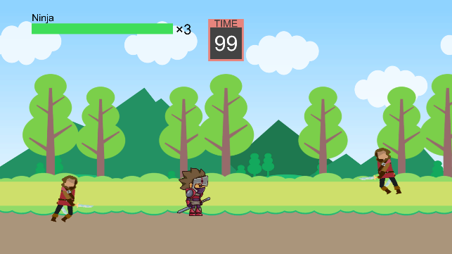

### 自機
<table>
    <tr>
        <td>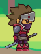</td>
        <td>
            Nキー押下で通常攻撃（連打で4連撃まで発生） 
            Mキー押下で必殺攻撃（体力を消費して発動） 
            矢印キーで移動 
            スペースキーでジャンプ（ジャンプ攻撃可）
        </td>
    </tr>
</table>

#### 攻撃アクション
<table>
    <tr>
        <td>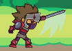</td>
        <td>
            通常攻撃の1～2撃目
        </td>
    </tr>
    <tr>
        <td>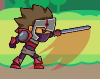</td>
        <td>
            通常攻撃の3撃目
        </td>
    </tr>
    <tr>
        <td>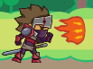</td>
        <td>
            通常攻撃の4撃目 
            ※敵を少し吹き飛ばす
        </td>
    </tr>
    <tr>
        <td>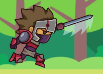</td>
        <td>
            ジャンプ攻撃 
            ※敵を少し吹き飛ばす
        </td>
    </tr>
    <tr>
        <td>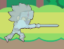</td>
        <td>
            必殺攻撃 
            体力を少し消費して短時間無敵化＆敵を少し吹き飛ばす
        </td>
    </tr>
</table>

### 敵機
<table>
    <tr>
        <td>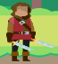</td>
        <td>
            Thief 
            移動速度は速いが攻撃力と体力は控えめ
        </td>
    </tr>
    <tr>
        <td>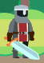</td>
        <td>
            Soldier 
            攻撃力は高いが移動速度と体力はあまり高くない
        </td>
    </tr>
    <tr>
        <td>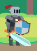</td>
        <td>
            Knight 
            体力は多いが移動速度と攻撃力はあまり高くない
        </td>
    </tr>
    <tr>
        <td>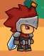</td>
        <td>
            Knight Leader(ボスキャラ) 
            移動速度は遅いが攻撃力と体力が多い
        </td>
    </tr>
</table>

### アイテム
<table>
    <tr>
        <td>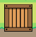</td>
        <td>
            回復アイテムが入っている箱 
            破壊すると回復アイテムが出現 
            どのアイテムが入っているかはランダム
        </td>
    </tr>
    <tr>
        <td>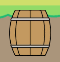</td>
        <td>
            回復アイテムが入っている樽 
            破壊すると回復アイテムが出現 
            どのアイテムが入っているかはランダム
        </td>
    </tr>
    <tr>
        <td>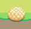</td>
        <td>体力が20％回復するアイテム</td>
    </tr>
    <tr>
        <td>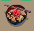</td>
        <td>体力が全回復するアイテム</td>
    </tr>
</table>